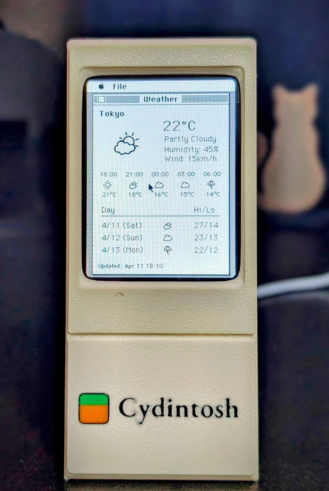
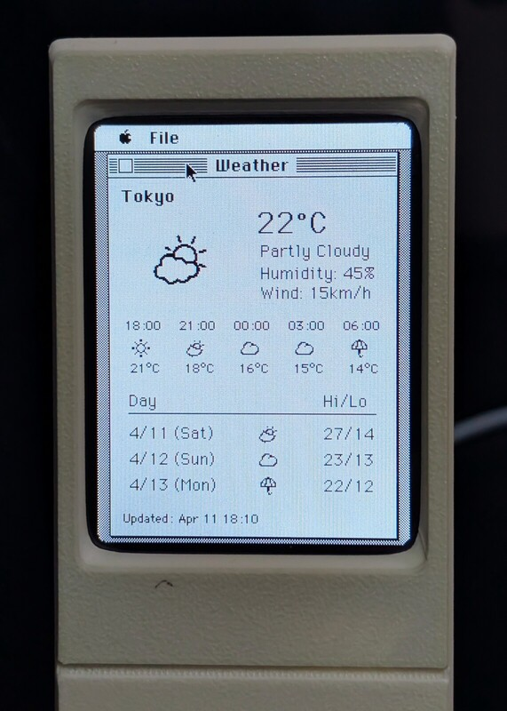
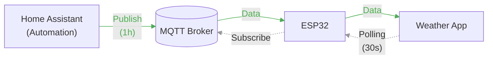
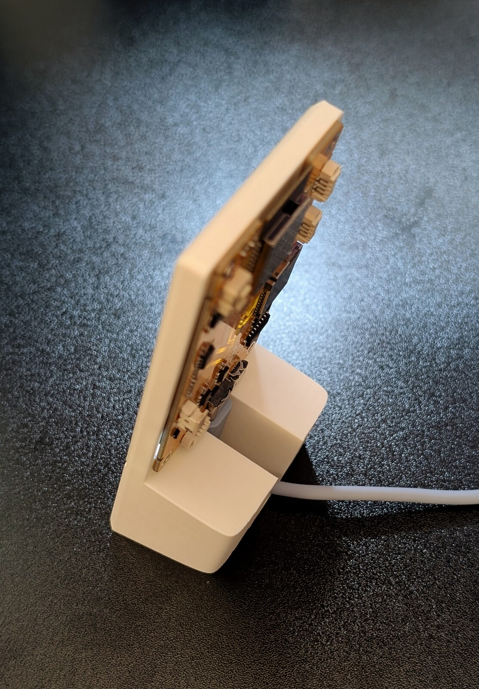

<div>


</div>

# Cydintosh

> **About this fork**
>
> This fork is focused on turning Cydintosh into a small smart-home Macintosh appliance:
>
> - browser-flashable firmware artifacts
> - MQTT-backed ESP32 services
> - classic Mac apps for lights, power, and door monitoring
> - a cleaner publishable path for ongoing custom development
>
> Replace placeholder fork URLs/names below before publishing.

A Macintosh Plus emulator port for the ESP32 Cheap Yellow Display family, with classic 68k Mac applications that use the ESP32 as a hardware/network coprocessor.

This fork extends the original project toward a more appliance-like smart-home workstation:

- Macintosh Plus emulation using umac and Musashi 68k emulator
- 240x320 ILI9341 LCD with XPT2046 touchpad emulation for mouse control
- *Homebrew* Mac applications built with Retro68
- IPC between Mac and ESP32 for WiFi, MQTT, hardware control, and smart-home data
- browser-based flashing flow with preserved stable firmware snapshots under [`web/`](./web)

## Fork status

This repository is an actively evolving fork intended for publishing and continued development.

### Current additions in this fork

- shared MQTT-backed ESP32 service layer for smart-home integrations
- initial Office Lights classic Mac application source and build artifacts
- browser flasher page and manifest under [`web/`](./web)
- preserved stable firmware images for browser flashing

### Current implementation status

- Existing shipped Mac apps: **Weather**, **WiFi**, **CydCtl**
- New MQTT-backed infrastructure: **in progress**
- New smart-home Mac apps planned:
  - **Office Lights**
  - **Socket Power Monitor**
  - **Door Events**

## Hardware BOM

| Component                | Quantity | Notes                                         |
| ------------------------ | :------- | :-------------------------------------------- |
| CYD2USB (ESP32-2432S028) | 1        | ESP32 with ILI9341 240x320 LCD, XPT2046 touch |
| M2x3 Self-Tapping screw  | 4        | For enclosure assembly                        |

## Getting Started

1. **Flash**: See [Building](#building) to build and flash the firmware/ROM/disk image
2. **Print**: 3D print the enclosure from [`./enclosure`](./enclosure)
3. **Assemble**: Mount the CYD into the enclosure and secure with four M2x3 self-tapping screws


## Hardware Notes

### Board: CYD2USB (ESP32-2432S028)

Tested and verified with the following hardware revision:

| Component | Detail |
|---|---|
| Board | ESP32-2432S028 (CYD2USB variant) |
| SoC | ESP32-D0WD-V3 (revision v3.0) |
| Features | Wi-Fi, BT, Dual Core, 240MHz |
| Flash | 4MB (manufacturer 0x5e, device 0x4016) |
| Crystal | 40MHz |
| USB-serial | CH340 (QinHeng Electronics, VID:1a86 PID:7523) |
| Display | ILI9341, 240×320, SPI |
| Touch | XPT2046, SPI (separate bus) |
| RAM | No PSRAM (128KB Mac RAM allocated from internal DRAM) |

### Display Configuration

The CYD2USB display requires specific MADCTL and rendering settings:

- **MADCTL register (0x36):** `0x08` (BGR color order, native portrait scan)
- **Display Inversion:** ON (command `0x21` in init sequence)
- **Rendering:** column-strip transfer with 90° CCW rotation in software
  - LCD pixel `(x, y)` ← Mac framebuffer pixel `(col=y, row=239-x)`
  - This maps the Mac's 240×320 portrait framebuffer to the panel's native scan order

### SPI Pin Mapping

| Function | GPIO |
|---|---|
| TFT MOSI | 13 |
| TFT SCLK | 14 |
| TFT CS | 15 |
| TFT DC | 2 |
| TFT RST | -1 (not connected) |
| TFT Backlight | 21 |
| Touch MOSI | 32 |
| Touch MISO | 39 |
| Touch CLK | 25 |
| Touch CS | 33 |

### Known Issues

- **Heap fragmentation:** Mac RAM (128KB) must be allocated before `lcd_cyd_init()` or the contiguous block allocation fails on newer ESP-IDF toolchains.
- **Sony eject suppression:** The Mac ROM's Sony driver probes and ejects disks during startup. The eject handler must not clear `dsDiskInPlace` or the disk will never mount.
- **System version:** System 6.x exceeds the 128KB Mac RAM limit ("Can't load a needed resource"). Use System 3.2 (Finder 5.3) which fits comfortably.

## Prerequisites for Emulator

- Mac Plus ROM v3 (4D1F8172, 128KB) — place as `vendor/rom.bin`
- System 3.2 bootable 800KB HFS disk image with System + Finder — place as `vendor/disk.img`
- The `vendor/` directory is gitignored; you must supply these files yourself

See also the [pico-mac](https://github.com/evansm7/pico-mac) repo for ROM and disk image requirements.

### Preparing vendor assets

```bash
# 1. Place your Mac Plus ROM v3 (128KB, checksum 4D1F8172) in vendor/
cp /path/to/MacPlusROM.bin vendor/rom.bin

# 2. Generate the patched ROM (patches screen resolution for CYD 240x320)
make prepare-rom

# 3. Prepare a bootable 800KB disk image with System 3.2 + Finder 5.3
#    Start from a System Tools 3.2 disk, add Cyd apps, place as vendor/disk.img
#    Then seed data/disk.img for the build:
make prepare-disk
```

## Building

A repository-level [`Makefile`](./Makefile) is included to make common flows explicit and repeatable.

**IMPORTANT:** Always use full-flash images when flashing. The merged firmware image
(without filesystem) pads up to `0x230000`, which can overwrite the start of the
filesystem partition. Full-flash images include everything in one file and avoid this.

Useful targets:

```bash
make help
make prepare
make build
make stable-artifacts
make original-artifacts
make flash-stable SERIAL_PORT=/dev/cu.usbserial-210
make flash-original SERIAL_PORT=/dev/cu.usbserial-210
make capture-logs SERIAL_PORT=/dev/cu.usbserial-210
```

```bash
# Clone and initialize submodules
git clone --recursive <your-fork-url>
cd cydintosh

# If you cloned without --recursive, initialize submodules:
git submodule update --init --recursive

# Setup m68k configuration
(cd external/umac/external/Musashi && ln -sf ../../../../include/m68kconf.h m68kconf.h)

# Generate m68kops.c
(cd external/umac && make prepare)

# Create user configuration
cp include/user_config.h.tmpl include/user_config.h
# Edit include/user_config.h with your WiFi/MQTT settings

# Generate patched ROM
make prepare-rom

# Prepare disk image
# The cyd_800k.dsk includes pre-built Mac applications (CydCtl, Weather, WiFi).
# To create a fresh disk with System 3.2 using Mini vMac emulator:
#   ./Mini\ vMac system3.dsk cyd_800k.dsk
#   Then copy System folder from system3.dsk to cyd_800k.dsk in the emulator

# Finally, copy the prepared disk to data/disk.img
make prepare-disk

# Build firmware
pio run

# Optional: upload directly if you have a serial device attached
pio run -t upload --upload-port /dev/ttyUSB0

# Upload disk image
pio run -t uploadfs --upload-port /dev/ttyUSB0
```

### Browser flashing

This fork also includes a browser-based flasher in [`web/`](./web):

- flasher page: [`web/index.html`](./web/index.html)
- manifest: [`web/manifest.json`](./web/manifest.json)
- preserved stable merged firmware: [`web/merged-firmware-stable-mqtt-v1.bin`](./web/merged-firmware-stable-mqtt-v1.bin)
- preserved stable filesystem image: [`web/littlefs-stable-mqtt-v1.bin`](./web/littlefs-stable-mqtt-v1.bin)

A tiny local server can be started for development, for example:

```bash
cd web
python3 -m http.server 8765
```

Then open `http://127.0.0.1:8765/` in Chrome or Edge.

For manual flashing with `esptool`, always use the full-flash images:

```bash
# Erase flash first (recommended for clean state):
esptool --port <serial-port> --baud 460800 erase_flash

# Custom/fork build:
esptool --port <serial-port> --baud 460800 write_flash \
  0x0000 web/full-flash-stable-mqtt-v1.bin

# Original/upstream-equivalent:
esptool --port <serial-port> --baud 460800 write_flash \
  0x0000 web/full-flash-original.bin

# Verify after flashing (optional but recommended):
esptool --port <serial-port> --baud 460800 verify_flash \
  0x0000 web/full-flash-original.bin
```

**Notes:**
- The full-flash image is 4MB. At `115200` baud this takes ~6 minutes and risks
  incomplete writes. Use `460800` or higher.
- Do not flash the merged firmware image alone — it pads up to `0x230000`
  and will overwrite the filesystem partition.

## Capturing boot logs

To reset the board and capture 10 seconds of serial logs to a file without using `screen`:

```bash
make capture-logs SERIAL_PORT=/dev/cu.usbserial-210
```

Or directly:

```bash
python3 tools/capture_serial_logs.py \
  --port /dev/cu.usbserial-210 \
  --baud 115200 \
  --duration 10 \
  --output logs/boot-log.txt
```

To use the Weather app, continue with [Home Assistant Setup](#home-assistant-setup).

## Development

```bash
# Format tracked C/C++ files
mise run format

# Check formatting without changes
mise run format:check
```

## Mac Applications

*Homebrew* Mac applications for Cydintosh.

| App          | Status              | Description                                      |
| ------------ | ------------------- | ------------------------------------------------ |
| Weather      | shipped             | Weather display via MQTT                         |
| CydCtl       | shipped             | Hardware control (backlight, RGB LED)            |
| WiFi         | shipped             | WiFi status and scan                             |
| OfficeLights | fork / in progress  | Office light control over Zigbee2MQTT via ESP32 |

<div>



</div>

### ESP32-Mac IPC Interface

The ESP32 exposes a command interface via memory-mapped region at `0xF00000`. Mac applications read/write this shared memory to communicate with ESP32:

| App / Domain   | Commands                                                         |
| -------------- | ---------------------------------------------------------------- |
| Weather        | `GET_WEATHER_DATA` ...                                           |
| CydCtl         | `GET_HW_STATE`, `SET_BACKLIGHT`, `SET_LED_RGB` ...               |
| WiFi           | `GET_WIFI_LIST`, `GET_WIFI_STATUS` ...                           |
| OfficeLights   | `GET_LIGHT_STATES`, `SET_LIGHT_STATE`, `SET_LIGHT_BRIGHTNESS` ... |
| Planned power  | `GET_POWER_STATES` ...                                           |
| Planned doors  | `GET_DOOR_STATES`, `GET_DOOR_EVENTS` ...                         |

See `include/umac_ipc.h` and `mac-app/common/esp_ipc.h` for full command definitions.

### Weather App



1. Home Assistant automation publishes weather data to MQTT every hour
2. ESP32 subscribes to MQTT topics and stores received data
3. Weather App polls ESP32 via IPC every 30s and renders the data

#### Home Assistant Setup

You need to set up MQTT and a weather integration in Home Assistant to use the Weather app.

- [MQTT Integration](https://www.home-assistant.io/integrations/mqtt/)
- [Weather Integrations](https://www.home-assistant.io/integrations/#weather)
- [Definitive guide to Weather integrations (Community)](https://community.home-assistant.io/t/definitive-guide-to-weather-integrations/736419)


1. In Home Assistant, go to **Settings > Automations > Create Automation > Edit YAML**
2. Paste the content of [`homeassistant/weather_to_mqtt.yaml`](homeassistant/weather_to_mqtt.yaml)
3. Edit the variables:
   ```yaml
   variables:
     weather_entity: "weather.home"
     topic_prefix: "home/weather"
     location: "Chicago"
   ```

#### ESP32 Configuration

WiFi and MQTT broker credentials are configured in [`include/user_config.h`](include/user_config.h.tmpl):

```c
...
#define WIFI_SSID       "YOUR_WIFI_SSID"
#define WIFI_PASSWORD   "YOUR_WIFI_PASSWORD"

#define MQTT_BROKER_URL "mqtt://192.168.1.100:1883"
#define MQTT_USERNAME   "YOUR_MQTT_USERNAME"
#define MQTT_PASSWORD   "YOUR_MQTT_PASSWORD"
```

In this fork, MQTT is no longer just for weather. The same ESP32-side client is being generalized to serve multiple classic Mac apps over IPC.

### Updating the Disk Image Manually

```bash
# Rebuild applications and update disk image
./tools/update-disk.sh data/disk.img

# Current note:
# disk-image update tooling may depend on classic HFS utilities being available
# in your host/container environment.

# Re-upload disk image
pio run -t uploadfs
```

## Gallery

<div>


</div>

## Acknowledgements

- [Musashi](https://github.com/kstenerud/Musashi) - m68k emulator
- [umac](https://github.com/evansm7/umac) - Mac Plus emulator core
- [pico-mac](https://github.com/evansm7/pico-mac) - Reference implementation for RP2040
- [ESP32-Cheap-Yellow-Display](https://github.com/witnessmenow/ESP32-Cheap-Yellow-Display) - CYD community
- For dependencies, see also src/idf_component.yml

## License

- **Software**: MIT
- **External libraries**: See respective licenses in `external/`

## TODO

- [ ] Finish generalized MQTT-backed app infrastructure
- [ ] Complete Office Lights UI/device validation on hardware
- [ ] Add Socket Power Monitor app
- [ ] Add Door Events app
- [ ] Improve HFS disk-image tooling portability across Linux environments
- [ ] Better icons for mac-apps

## Publishing checklist for this fork

Before publishing the fork, review and replace project-specific placeholders:

- [ ] Replace `git clone --recursive <your-fork-url>` with the real repository URL
- [ ] Review `README.md` for any remaining upstream-specific wording that should now refer to the fork
- [ ] Decide whether `CYD2USB` should remain the preferred board name in docs, or whether `ESP32-2432S028` should be primary
- [ ] Confirm the browser flasher should point at `stable-mqtt-v1` by default
- [ ] Decide whether stable firmware artifacts in `web/` should be committed or generated during release
- [ ] Review whether `rom.bin` / patched ROM workflow wording is legally and operationally appropriate for public release
- [ ] Verify `tools/update-disk.sh` behavior and document host requirements for HFS tooling
- [ ] Add screenshots for new fork-specific apps once they are running on hardware
- [ ] Update any future fork homepage, issue tracker, or release links once created

## Additional repository review notes

Current assumptions worth revisiting before publishing:

- The build section still assumes a developer-managed ROM workflow and local serial flashing path.
- The browser flasher is currently geared toward local/stable artifacts in `web/`, which is great for development but may need a release/versioning policy.
- The new Office Lights app is source-complete enough to mention, but should ideally be hardware-validated before being presented as a primary feature.
- HFS disk update tooling remains environment-sensitive on Linux and should be called out clearly in release notes or docs.
- MQTT configuration is still driven by `include/user_config.h`; longer term, a clearer fork-specific configuration story may help public adoption.

## Related Projects

- [likeablob/denki-kurage](https://github.com/likeablob/denki-kurage): Another CYD-based gadget
- Macbar (WIP):  ESP32-S3 port utilizing PSRAM
- Macbento (WIP)
