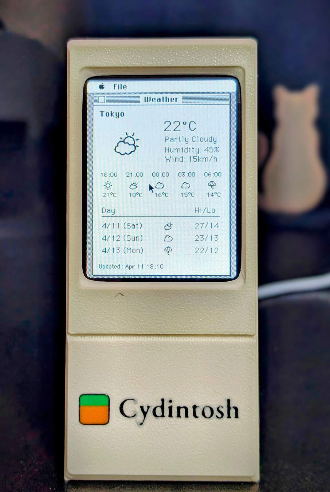
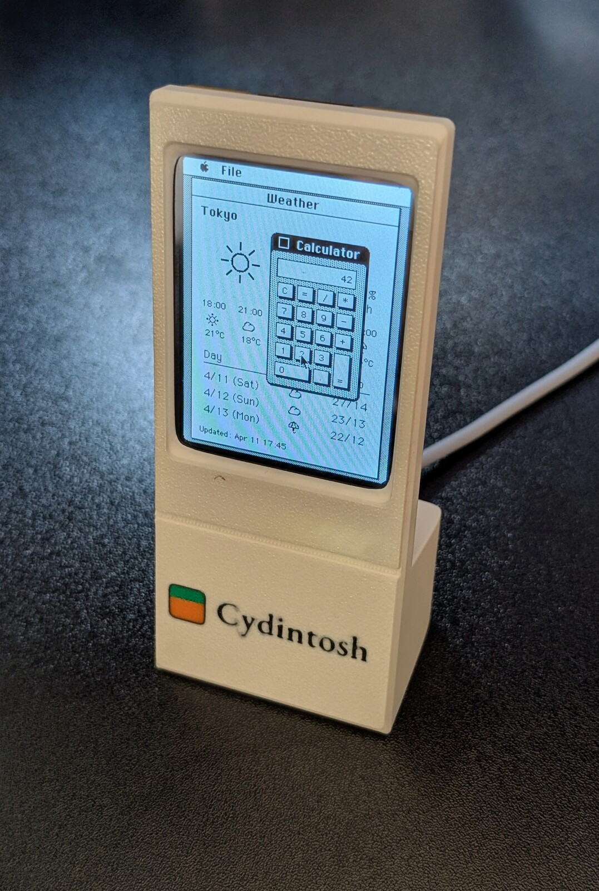
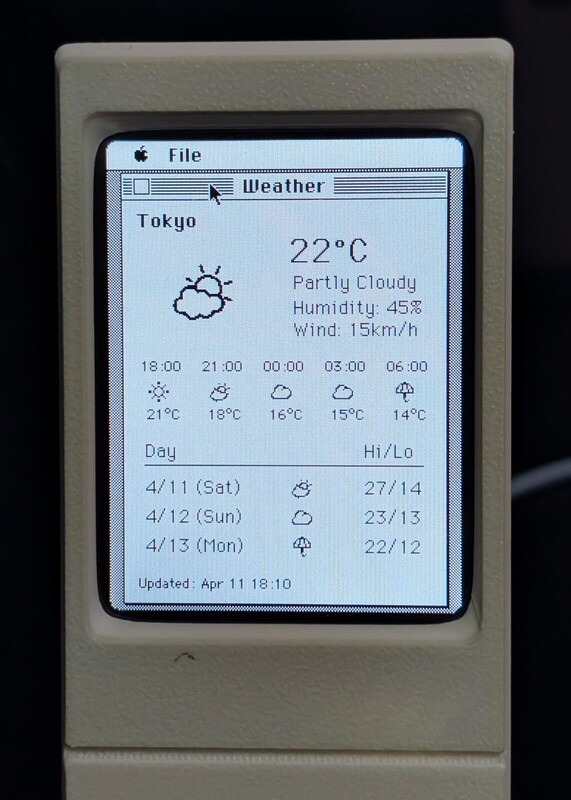
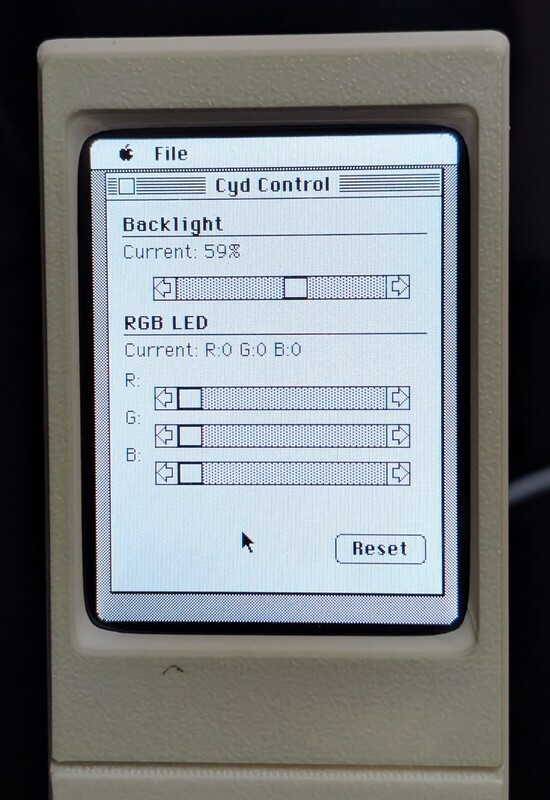
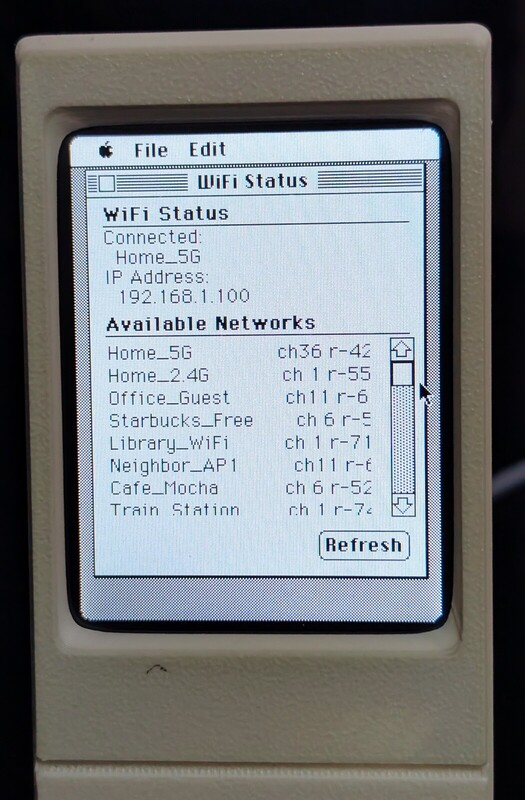
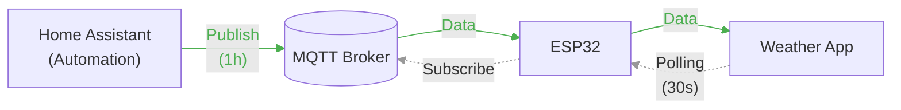
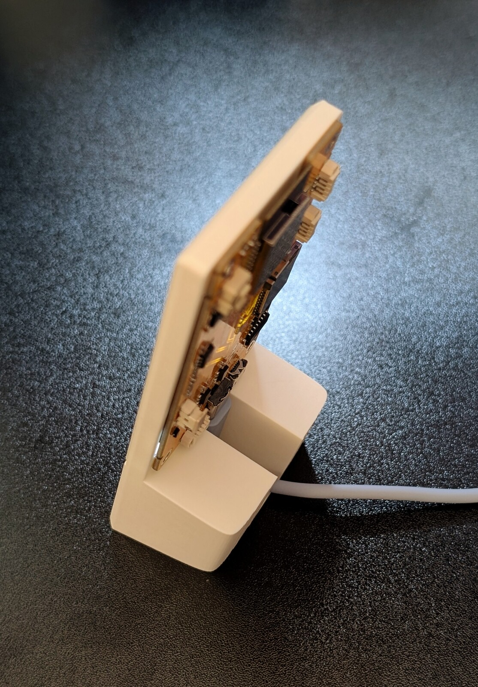

<div>


</div>

# Cydintosh

> **About this fork**
>
> This fork is focused on turning Cydintosh into a small smart-home Macintosh appliance:
>
> - browser-flashable firmware artifacts
> - MQTT-backed ESP32 services
> - classic Mac apps for lights, power, and door monitoring
> - a cleaner publishable path for ongoing custom development
>
> Replace placeholder fork URLs/names below before publishing.

A Macintosh Plus emulator port for the ESP32 Cheap Yellow Display family, with classic 68k Mac applications that use the ESP32 as a hardware/network coprocessor.

This fork extends the original project toward a more appliance-like smart-home workstation:

- Macintosh Plus emulation using umac and Musashi 68k emulator
- selectable board profiles for 240×320 ILI9341/XPT2046 CYD boards and 800×480 RGB/GT911 ESP32-S3 panels
- *Homebrew* Mac applications built with Retro68
- IPC between Mac and ESP32 for WiFi, MQTT, hardware control, and smart-home data
- browser-based flashing flow with preserved stable firmware snapshots under [`web/`](./web)

## Fork status

This repository is an actively evolving fork intended for publishing and continued development.

### Current additions in this fork

- shared MQTT-backed ESP32 service layer for smart-home integrations
- selectable board profiles under [`include/boards/`](./include/boards) for CYD2USB and ESP32-8048S043C hardware
- initial Office Lights classic Mac application source and build artifacts
- browser flasher page and manifest under [`web/`](./web)
- board-specific full-flash firmware images for browser flashing

### Current implementation status

- Existing shipped Mac apps: **Weather**, **WiFi**, **CydCtl**
- CYD2USB/ESP32-2432S028 profile: existing ILI9341/XPT2046 target, build-compatible
- ESP32-8048S043C profile: boots from the corrected ESP32-S3 full-flash image; PSRAM, backlight, RGB panel driver creation, and GT911 detection are confirmed in serial logs; visible RGB output/emulator-loop verification is still in progress
- New MQTT-backed infrastructure: **in progress**
- New smart-home Mac apps planned:
  - **Office Lights**
  - **Socket Power Monitor**
  - **Door Events**

## Hardware BOM

| Component | Quantity | Notes |
| ---------- | :------- | :---- |
| CYD2USB (ESP32-2432S028) | 1 | Original ESP32 target with ILI9341 240×320 LCD, XPT2046 touch |
| Sunton ESP32-8048S043C | 1 | New ESP32-S3 N16R8 target with 800×480 RGB LCD, GT911 touch |
| M2x3 Self-Tapping screw | 4 | For CYD enclosure assembly |

## Getting Started

1. **Flash**: See [Building](#building) to build and flash the firmware/ROM/disk image
2. **Print**: 3D print the enclosure from [`./enclosure`](./enclosure)
3. **Assemble**: Mount the CYD into the enclosure and secure with four M2x3 self-tapping screws


## Hardware Notes

### Board: CYD2USB (ESP32-2432S028)

Tested and verified with the following hardware revision:

| Component | Detail |
|---|---|
| Board | ESP32-2432S028 (CYD2USB variant) |
| SoC | ESP32-D0WD-V3 (revision v3.0) |
| Features | Wi-Fi, BT, Dual Core, 240MHz |
| Flash | 4MB (manufacturer 0x5e, device 0x4016) |
| Crystal | 40MHz |
| USB-serial | CH340 (QinHeng Electronics, VID:1a86 PID:7523) |
| Display | ILI9341, 240×320, SPI |
| Touch | XPT2046, SPI (separate bus) |
| RAM | No PSRAM (128KB Mac RAM allocated from internal DRAM) |

### Display Configuration

The CYD2USB display panel is addressed in native portrait orientation:

- **MADCTL register (0x36):** `0x08` (BGR color order, no mirrors, no axis swap)
- **Display Inversion:** ON (command `0x21` in init sequence)
- **Rendering:** direct 1:1 pixel mapping with column-strip SPI transfer
  - LCD pixel `(x, y)` ← Mac framebuffer pixel `(col=x, row=y)`
  - No software rotation needed — the Mac's 240×320 portrait framebuffer maps directly to the panel's native scan order
- **Orientation:** portrait with USB connector at the bottom

### Touch Configuration

The XPT2046 touch controller operates in trackpad (relative) mode:

| Setting | Value | Notes |
|---|---|---|
| `swap_xy` | 0 | No axis swap needed for portrait MADCTL |
| `mirror_x` | 1 | Flip X to match portrait display scan |
| `mirror_y` | 1 | Flip Y to match portrait display scan |
| `x_max` | 240 | Matches `SCREEN_WIDTH` |
| `y_max` | 320 | Matches `SCREEN_HEIGHT` |

Touch input uses a trackpad/relative mode: sliding a finger moves the Mac cursor by the touch delta. Double-tap to click, double-tap and hold to drag.

### SPI Pin Mapping

| Function | GPIO |
|---|---|
| TFT MOSI | 13 |
| TFT SCLK | 14 |
| TFT CS | 15 |
| TFT DC | 2 |
| TFT RST | -1 (not connected) |
| TFT Backlight | 21 |
| Touch MOSI | 32 |
| Touch MISO | 39 |
| Touch CLK | 25 |
| Touch CS | 33 |

### Board: Sunton ESP32-8048S043C

Tested/detected hardware for the new ESP32-S3 target:

| Component | Detail |
|---|---|
| Board | Sunton ESP32-8048S043C |
| SoC | ESP32-S3 QFN56, revision v0.2 |
| Features | Wi-Fi, BT 5 LE, dual core + LP core, 240MHz |
| Flash | 16MB (manufacturer 0x46, device 0x4018), 3.3V, quad eFuse; build uses DIO flash mode |
| PSRAM | 8MB embedded PSRAM, configured as octal 80MHz |
| USB-serial | CH340 (QinHeng Electronics, VID:1a86 PID:7523); serial numbering can change, prefer `/dev/serial/by-id/usb-1a86_USB_Serial-if00-port0` or check `pio device list` |
| Display | 800×480 RGB DPI LCD |
| Touch | GT911 capacitive touch, I2C |

#### ESP32-8048S043C RGB LCD Pin Mapping

| Function | GPIO |
|---|---|
| Backlight PWM | 2 |
| RGB DE | 40 |
| RGB HSYNC | 39 |
| RGB VSYNC | 41 |
| RGB PCLK | 42 |
| Red data | 45, 48, 47, 21, 14 |
| Green data | 5, 6, 7, 15, 16, 4 |
| Blue data | 8, 3, 46, 9, 1 |
| GT911 SDA | 19 |
| GT911 SCL | 20 |

The Mac framebuffer remains **240×320** to match the patched ROM. On the 800×480 panel it is rotated clockwise, scaled 2× to 640×480, and centered horizontally with an 80px black margin on each side. Touch is still used as a relative trackpad; GT911 physical deltas are transformed back into Mac cursor deltas.

#### ESP32-8048S043C bring-up status

Confirmed after flashing the corrected 16MB full image:

- ESP32-S3 ROM loads the second-stage bootloader from `0x0`
- partition table uses `0x10000` app, `0x410000` ROM, `0x430000` LittleFS
- app starts under ESP-IDF 5.5.2
- 8MB octal PSRAM is detected and passes memory test
- RGB panel driver initializes for 800×480
- backlight GPIO2 reaches 100% duty
- GT911 is found at I2C address `0x5d`

Still pending:

- visible RGB framebuffer output
- explicit confirmation that `umac_task` starts and reaches ROM/disk/emulation logs
- display-frame notification and draw-path verification

### Board Profile Source Layout

Shared board selection lives in [`include/board_profiles.h`](./include/board_profiles.h). It defaults to the CYD2USB profile for backwards compatibility and includes exactly one smaller board profile header:

| Board macro | Profile header | Display backend | Touch backend |
|---|---|---|---|
| `CYD_BOARD_ESP32_2432S028` | [`include/boards/esp32_2432s028.h`](./include/boards/esp32_2432s028.h) | ILI9341 SPI | XPT2046 SPI |
| `CYD_BOARD_ESP32_8048S043C` | [`include/boards/esp32_8048s043c.h`](./include/boards/esp32_8048s043c.h) | ESP-IDF RGB panel | GT911 I2C |

`board_profiles.h` also contains compile-time sanity checks so new profiles must select exactly one LCD backend, avoid conflicting touch backends, define render dimensions, and keep the rendered Mac framebuffer inside the physical LCD bounds.

### Changes from Upstream / Known Issues

- **Heap fragmentation:** Mac RAM (128KB) must be allocated with `MALLOC_CAP_8BIT` **before** `lcd_cyd_init()`, or the contiguous block allocation fails on newer ESP-IDF/PlatformIO toolchains. The smaller DMA-capable framebuffer (9.6KB) is allocated after LCD init.
- **Sony eject suppression:** The Mac ROM's Sony driver probes and ejects disks during startup. The eject handler in `disc.c` (case 7) must not clear `dsDiskInPlace` or call `umac_disc_ejected()`, otherwise the disk will never mount. The `umac_disc_ejected()` default (which resets the emulator) is overridden with a no-op in `main.c`.
- **System version:** System 6.x exceeds the 128KB Mac RAM limit ("Can't load a needed resource"). Use **System 3.2** (Finder 5.3) which fits comfortably with 389KB free on the 800KB disk alongside the Cyd apps.
- **Musashi m68kconf.h:** The project's `include/m68kconf.h` must be copied or symlinked into `external/umac/external/Musashi/` before building, because Musashi's `m68kcpu.h` includes it via relative path and will find the wrong (default) version otherwise. The `make prepare` target handles this automatically and is now a dependency of `make build`.
- **ESP32-S3 bootloader offset:** ESP32-S3 images must place the bootloader at `0x0`, unlike ESP32 images which use `0x1000`. `make stable-artifacts PIO_ENV=esp32-8048s043c` handles this via board-specific `BOOTLOADER_OFFSET`; do not hand-merge S3 images with the ESP32 offset.

## Prerequisites for Emulator

- Mac Plus ROM v3 (4D1F8172, 128KB) — place as `vendor/rom.bin`
- System 3.2 bootable 800KB HFS disk image with System + Finder — place as `vendor/disk.img`
- The `vendor/` directory is gitignored; you must supply these files yourself

See also the [pico-mac](https://github.com/evansm7/pico-mac) repo for ROM and disk image requirements.

### Preparing vendor assets

```bash
# 1. Place your Mac Plus ROM v3 (128KB, checksum 4D1F8172) in vendor/
cp /path/to/MacPlusROM.bin vendor/rom.bin

# 2. Generate the patched ROM (patches screen resolution for CYD 240x320)
make prepare-rom

# 3. Prepare a bootable 800KB disk image with System 3.2 + Finder 5.3
#    Start from a System Tools 3.2 disk, add Cyd apps, place as vendor/disk.img
#    Then seed data/disk.img for the build:
make prepare-disk
```

## Building

A repository-level [`Makefile`](./Makefile) is included to make common flows explicit and repeatable.

**IMPORTANT:** Always use full-flash images when flashing. Single firmware-only
images can collide with board-specific ROM/filesystem offsets if used incorrectly.
Full-flash images include bootloader, partition table, firmware, patched ROM, and
filesystem in one file and avoid this.

Useful targets:

```bash
make help
make prepare
make build PIO_ENV=esp32-cyd2usb
make build PIO_ENV=esp32-8048s043c
make stable-artifacts PIO_ENV=esp32-cyd2usb
make stable-artifacts PIO_ENV=esp32-8048s043c
make original-artifacts
make flash-stable PIO_ENV=esp32-cyd2usb SERIAL_PORT=<serial-port>
make flash-stable PIO_ENV=esp32-8048s043c SERIAL_PORT=/dev/serial/by-id/usb-1a86_USB_Serial-if00-port0
make flash-original SERIAL_PORT=<serial-port>
make capture-logs SERIAL_PORT=<serial-port>
```

Direct PlatformIO builds are also supported:

```bash
pio run -e esp32-cyd2usb
pio run -e esp32-8048s043c
```

```bash
# Clone and initialize submodules
git clone --recursive <your-fork-url>
cd cydintosh

# If you cloned without --recursive, initialize submodules:
git submodule update --init --recursive

# Setup m68k configuration
(cd external/umac/external/Musashi && ln -sf ../../../../include/m68kconf.h m68kconf.h)

# Generate m68kops.c
(cd external/umac && make prepare)

# Create user configuration
cp include/user_config.h.tmpl include/user_config.h
# Edit include/user_config.h with your WiFi/MQTT settings

# Generate patched ROM
make prepare-rom

# Prepare disk image
# The cyd_800k.dsk includes pre-built Mac applications (CydCtl, Weather, WiFi).
# To create a fresh disk with System 3.2 using Mini vMac emulator:
#   ./Mini\ vMac system3.dsk cyd_800k.dsk
#   Then copy System folder from system3.dsk to cyd_800k.dsk in the emulator

# Finally, copy the prepared disk to data/disk.img
make prepare-disk

# Build firmware
pio run -e esp32-cyd2usb
pio run -e esp32-8048s043c

# Prefer full-flash artifacts over separate upload/uploadfs operations:
make stable-artifacts PIO_ENV=esp32-cyd2usb
make stable-artifacts PIO_ENV=esp32-8048s043c
```

### Browser flashing

This fork also includes a browser-based flasher in [`web/`](./web):

- flasher page: [`web/index.html`](./web/index.html)
- manifest: [`web/manifest.json`](./web/manifest.json)
- generated full-flash images: `web/full-flash-esp32-cyd2usb.bin` and `web/full-flash-esp32-8048s043c.bin`

A tiny local server can be started for development, for example:

```bash
cd web
python3 -m http.server 8765
```

Then open `http://127.0.0.1:8765/` in Chrome or Edge.

For manual flashing with `esptool`, always use the full-flash images:

```bash
# Erase flash first (recommended for clean state):
esptool --port <serial-port> --baud 460800 erase_flash

# Custom/fork build:
esptool --port <serial-port> --baud 460800 write_flash \
  0x0000 web/full-flash-esp32-cyd2usb.bin

# ESP32-8048S043C build:
esptool --port <serial-port> --baud 460800 write_flash \
  0x0000 web/full-flash-esp32-8048s043c.bin

# Original/upstream-equivalent:
esptool --port <serial-port> --baud 460800 write_flash \
  0x0000 web/full-flash-original.bin

# If you verify manually, do it immediately after writing and before the app boots
# and updates NVS/phy sectors. The Makefile target handles this with --after no-reset.
esptool --port <serial-port> --baud 460800 verify_flash \
  0x0000 web/full-flash-esp32-cyd2usb.bin
```

**Notes:**
- The CYD2USB full-flash image is 4MB; the ESP32-8048S043C full-flash image is 16MB.
  At `115200` baud these are slow and risk incomplete writes. Use `460800` or higher.
- Do not flash firmware-only images when you need ROM/disk contents. Use the board-specific
  full-flash image generated by `make stable-artifacts PIO_ENV=...`.

## Capturing boot logs

To reset the board and capture 10 seconds of serial logs to a file without using `screen`:

```bash
make capture-logs SERIAL_PORT=<serial-port>
```

Or directly:

```bash
python3 tools/capture_serial_logs.py \
  --port <serial-port> \
  --baud 115200 \
  --duration 10 \
  --output logs/boot-log.txt
```

To use the Weather app, continue with [Home Assistant Setup](#home-assistant-setup).

## Development

```bash
# Format tracked C/C++ files
mise run format

# Check formatting without changes
mise run format:check
```

## Mac Applications

*Homebrew* Mac applications for Cydintosh.

| App          | Status              | Description                                      |
| ------------ | ------------------- | ------------------------------------------------ |
| Weather      | shipped             | Weather display via MQTT                         |
| CydCtl       | shipped             | Hardware control (backlight, RGB LED)            |
| WiFi         | shipped             | WiFi status and scan                             |
| OfficeLights | fork / in progress  | Office light control over Zigbee2MQTT via ESP32 |

<div>



</div>

### ESP32-Mac IPC Interface

The ESP32 exposes a command interface via memory-mapped region at `0xF00000`. Mac applications read/write this shared memory to communicate with ESP32:

| App / Domain   | Commands                                                         |
| -------------- | ---------------------------------------------------------------- |
| Weather        | `GET_WEATHER_DATA` ...                                           |
| CydCtl         | `GET_HW_STATE`, `SET_BACKLIGHT`, `SET_LED_RGB` ...               |
| WiFi           | `GET_WIFI_LIST`, `GET_WIFI_STATUS` ...                           |
| OfficeLights   | `GET_LIGHT_STATES`, `SET_LIGHT_STATE`, `SET_LIGHT_BRIGHTNESS` ... |
| Planned power  | `GET_POWER_STATES` ...                                           |
| Planned doors  | `GET_DOOR_STATES`, `GET_DOOR_EVENTS` ...                         |

See `include/umac_ipc.h` and `mac-app/common/esp_ipc.h` for full command definitions.

### Weather App


```mermaid
flowchart LR
    HA["Home Assistant<br/>(Automation)"] -->|"Publish<br>(1h)"| MB[("MQTT Broker")]
    MB -->|"Data"| ESP["ESP32"]
    ESP -->|"Data"| MAC["Weather App"]
    ESP -.->|"Subscribe"| MB
    MAC -.->|"Polling<br>(30s)"| ESP
    
    linkStyle 0,1,2 stroke:#4CAF50,color:#4CAF50
    linkStyle 3,4 stroke:#999
```

1. Home Assistant automation publishes weather data to MQTT every hour
2. ESP32 subscribes to MQTT topics and stores received data
3. Weather App polls ESP32 via IPC every 30s and renders the data

#### Home Assistant Setup

You need to set up MQTT and a weather integration in Home Assistant to use the Weather app.

- [MQTT Integration](https://www.home-assistant.io/integrations/mqtt/)
- [Weather Integrations](https://www.home-assistant.io/integrations/#weather)
- [Definitive guide to Weather integrations (Community)](https://community.home-assistant.io/t/definitive-guide-to-weather-integrations/736419)


1. In Home Assistant, go to **Settings > Automations > Create Automation > Edit YAML**
2. Paste the content of [`homeassistant/weather_to_mqtt.yaml`](homeassistant/weather_to_mqtt.yaml)
3. Edit the variables:
   ```yaml
   variables:
     weather_entity: "weather.home"
     topic_prefix: "home/weather"
     location: "Chicago"
   ```

#### ESP32 Configuration

WiFi and MQTT broker credentials are configured in [`include/user_config.h`](include/user_config.h.tmpl):

```c
...
#define WIFI_SSID       "YOUR_WIFI_SSID"
#define WIFI_PASSWORD   "YOUR_WIFI_PASSWORD"

#define MQTT_BROKER_URL "mqtt://192.168.1.100:1883"
#define MQTT_USERNAME   "YOUR_MQTT_USERNAME"
#define MQTT_PASSWORD   "YOUR_MQTT_PASSWORD"
```

In this fork, MQTT is no longer just for weather. The same ESP32-side client is being generalized to serve multiple classic Mac apps over IPC.

### Updating the Disk Image Manually

```bash
# Rebuild applications and update disk image
./tools/update-disk.sh data/disk.img

# Current note:
# disk-image update tooling may depend on classic HFS utilities being available
# in your host/container environment.

# Regenerate and flash a board-specific full image after changing data/disk.img
make stable-artifacts PIO_ENV=esp32-cyd2usb
make stable-artifacts PIO_ENV=esp32-8048s043c
```

## Gallery

<div>


</div>

## Acknowledgements

- [Musashi](https://github.com/kstenerud/Musashi) - m68k emulator
- [umac](https://github.com/evansm7/umac) - Mac Plus emulator core
- [pico-mac](https://github.com/evansm7/pico-mac) - Reference implementation for RP2040
- [ESP32-Cheap-Yellow-Display](https://github.com/witnessmenow/ESP32-Cheap-Yellow-Display) - CYD community
- For dependencies, see also src/idf_component.yml

## License

- **Software**: MIT
- **External libraries**: See respective licenses in `external/`

## TODO

- [ ] Finish generalized MQTT-backed app infrastructure
- [ ] Complete Office Lights UI/device validation on hardware
- [ ] Add Socket Power Monitor app
- [ ] Add Door Events app
- [ ] Improve HFS disk-image tooling portability across Linux environments
- [ ] Better icons for mac-apps

## Publishing checklist for this fork

Before publishing the fork, review and replace project-specific placeholders:

- [ ] Replace `git clone --recursive <your-fork-url>` with the real repository URL
- [ ] Review `README.md` for any remaining upstream-specific wording that should now refer to the fork
- [x] Use `CYD2USB (ESP32-2432S028)` consistently for the original board profile
- [ ] Confirm release/versioning policy for generated browser flasher artifacts
- [ ] Decide whether stable firmware artifacts in `web/` should be committed or generated during release
- [ ] Review whether `rom.bin` / patched ROM workflow wording is legally and operationally appropriate for public release
- [ ] Verify `tools/update-disk.sh` behavior and document host requirements for HFS tooling
- [ ] Add screenshots for new fork-specific apps once they are running on hardware
- [ ] Update any future fork homepage, issue tracker, or release links once created

## Additional repository review notes

Current assumptions worth revisiting before publishing:

- The build section still assumes a developer-managed ROM workflow and local serial flashing path.
- The browser flasher is currently geared toward local/stable artifacts in `web/`, which is great for development but may need a release/versioning policy.
- The new Office Lights app is source-complete enough to mention, but should ideally be hardware-validated before being presented as a primary feature.
- HFS disk update tooling remains environment-sensitive on Linux and should be called out clearly in release notes or docs.
- MQTT configuration is still driven by `include/user_config.h`; longer term, a clearer fork-specific configuration story may help public adoption.

## Related Projects

- [likeablob/denki-kurage](https://github.com/likeablob/denki-kurage): Another CYD-based gadget
- Macbar (WIP):  ESP32-S3 port utilizing PSRAM
- Macbento (WIP)
