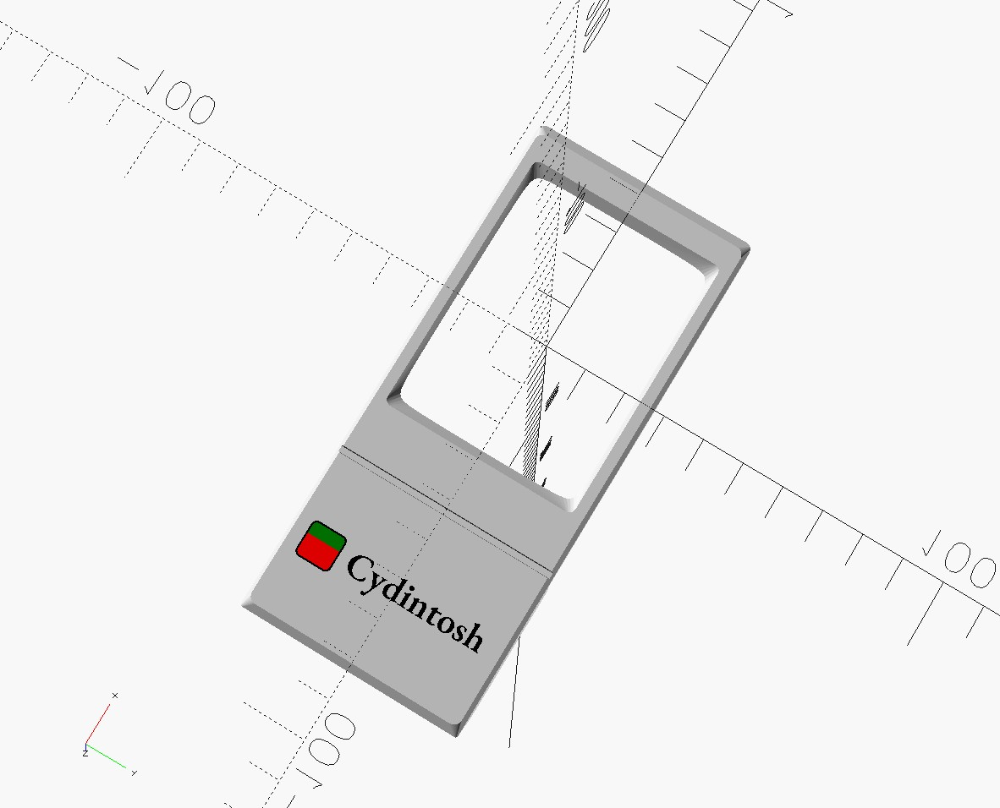

# cydintosh/enclosure

## Prerequisites

- OpenSCAD (nightly build) 2026.01
- colorscad (1c5a06bd)
- GNU Make
- ImageMagick
- BOSL2 (included as submodule)

## Build

```sh
# Sync submodules
$ git submodule update --init --recursive

# Generate .stl files.
$ make all -B

# Generate thumbnail images.
$ make images -B

# Generate the .3mf file.
$ OPENSCAD_CMD=openscad-nightly colorscad -i cydintosh_stand.scad -o cydintosh_stand.3mf -f
```

## Parts

|                                          | STL (Single color)                           | 3MF (Multi-color)                            |
| ---------------------------------------- | -------------------------------------------- | -------------------------------------------- |
|  | [cydintosh_stand.stl](./cydintosh_stand.stl) | [cydintosh_stand.3mf](./cydintosh_stand.3mf) |

## Print conditions

- Multi color printing (Optional, Use .3mf)
- 1.75mm PLA (White, Black, Orange, Green)
- 0.12mm layer height
